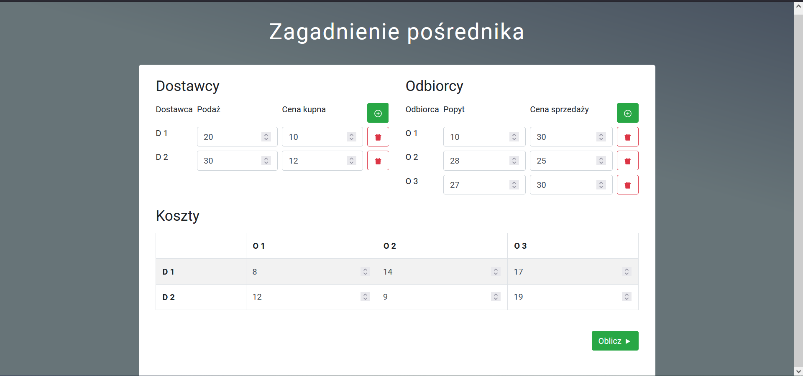
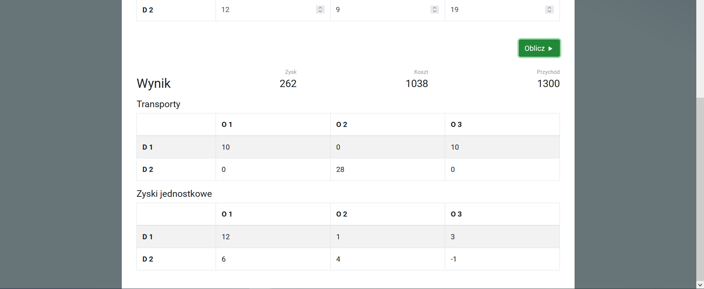
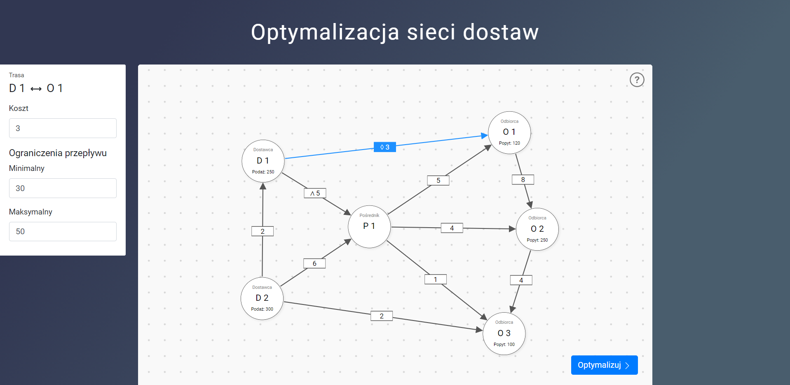
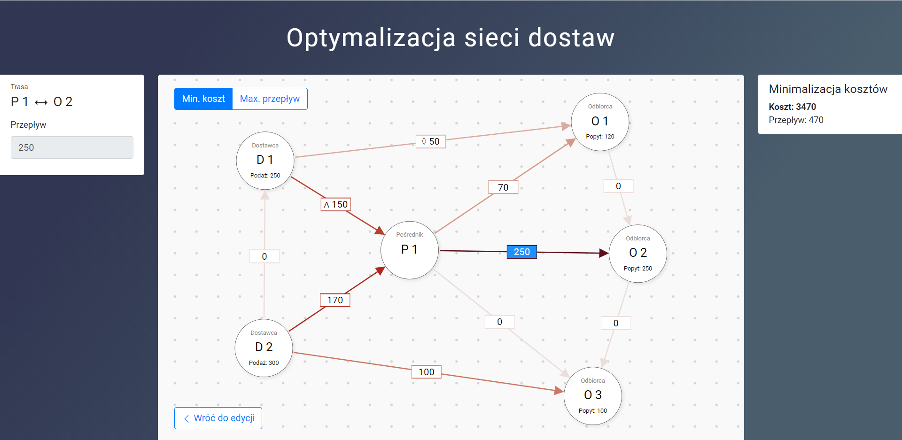
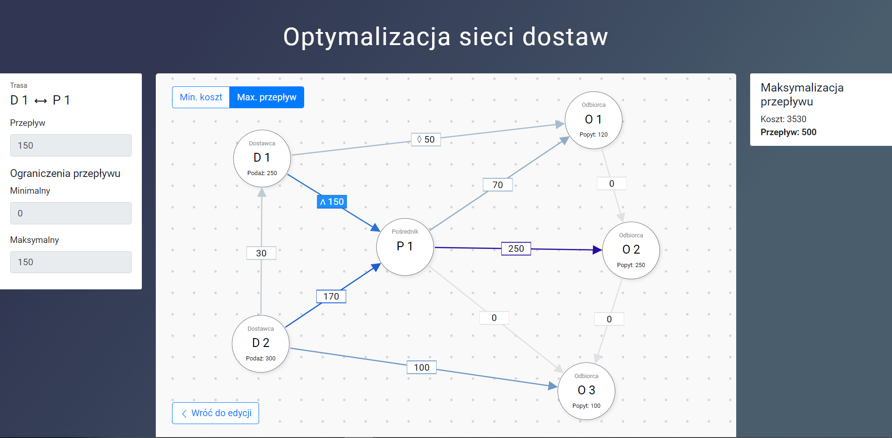

| | |
|-|-|
| **Wykonujący projekt** | Maciej Adamus <br/> Paweł Duda |
| **Nazwa przedmiotu** | Badania Operacyjne i Logistyka |
| **Kierunek studiów** | Informatyka Stosowana |
| **Rok** | 3 |
| **Semestr** | 6 |
| **Grupa** | 1 |
| **Nr zespołu** | 1 |

# Temat projektu
W obydwu projektach mieliśmy zaimplementować aplikację webową z interfejsem do wpisywania danych oraz wizualizacją wyników.

## Zagadnienie pośrednika
Zadana ilość dostawców: 2
Zadana ilośc odbiorców: 3
Aplikacja nie miała uwzględniać blokowania tras.

## Programowanie liniowe
W ramach zagadnienia z programowania liniowego wykonaliśmy aplikację pozwalającą na optymalizację przepływu towarów w sieci dostaw zawierającej dostawców, odbiorców i pośredników.

Pełny kod źródłowy aplikacji znajduje się na [githubie](https://github.com/maciejewiczow/boil-project), a działanie aplikacji można zobaczyć online na [github pages](https://maciejewiczow.github.io/boil-project/).

# Opis zastosowanych metod
## Zagadnienie pośrednika
W zagadnieniu pośrednika algorytm działania wyglądał następująco:
Każdy odbiorca miał określony popyt oraz cenę zakupu, a każdy dostawca miał określoną podaż oraz cenę sprzedaży.
Jeśli popyt i podż nie były sobie równe należało wprowadzić fikcyjnego dostawcę oraz fikcyjnego odbiorcę.
Każda trasa pomiędzy każdym dostawcą i każdym odbiorcą miała określony koszt jednostkowy transportu.
Na podstawie tego możliwe było utworzenie tablicy zysków jednostkowych (z).
Algorytm zaczynał się od wyznaczenia początkowych tras bazowych metodą maksymalnego elementu macierzy.
Natępnie wyznaczano zmienne dualne alfa i beta za pomocą rozwiązania równania macierzowego $Ax = B$, gdzie macierz A zawierała 1 przy odpowiednich dla danego równania alfach i betach, a wektor B zawierał odpowiadającą danej parze zmiennych dualnych wartość z tabeli transportów.
Potem na podstawie obliczonych zmiennych dualnych wyznaczano zmienne kryterialne na pozostałych trasach za pomocą wzoru $\Delta_{ij} = z_{ij} - \alpha_i - \beta_j$.
W przypadku jeżeli któraś ze zmiennych kryterialnych miała wartość dodatnią znajdowany był cykl zmian oraz dokonano na jego podstawie nowego obsadzenia tras. Proces ten był powtarzany do momentu aż wszystkie zmienne kryterialne były niedodanie.

## Programowanie liniowe
Aplikacja przyjmowała od użytkownika zagadnienie w postaci grafu reprezentującego rozpatrywaną sieć dostaw z węzłami odpowiadającymi dostawcom/odbiorcom/pośrednikom i krawędziami reprezentującymi trasy pomiędzy węzłami.
Następnie na podstawie grafu program generuje funkcję celu, w której zmiennymi decyzyjnymi są przepływy na poszczególnych trasach, oraz zestaw ograniczeń zapewniających, że popyt każdego odbiorcy jest spełniony, podaż żadnego z dostawców nie jest przekroczona oraz że każdy pośrednik wydaje tyle samo towaru ile otrzymał (suma wpływów równa się sumie wypływów). Program potrafi generować też dodatkowe ograniczenia odpowiadające ewentualnym ograniczeniom maksymalnego i/lub minimalnego przepływu na danej trasie.

Program dokonuje 2 optymalizacji z dwoma różnymi funkcjami celu - pierwsza przedstawia sumaryczny koszt przewozu na wszystkich trasach i podlega minimalizacji, a druga przedstawia sumaryczny przepływ towarów w całej sieci i podlega maksymalizacji.

Tak przygotowane ograniczenia i funkcje celu zostają przekazane do biblioteki GLPK, która na ich podstawie znajduje dwa rozwiązania optymalne, dające odpowiednio najmniejszą i największą możliwą wartość odpowiedniej funkcji celu.

# Zastosowane narzędzia informatyczne
React (z Create React App), TypeScript, CSS - do stworzenia interfejsu graficznego w przeglądarce.

Do zagadnienia pośrednika - biblioteka [math.js](https://www.npmjs.com/package/mathjs) umożliwiająca operacje na macierzach i rozwiązywanie układów równań liniowych.

Do programowania liniowego - biblioteka [glpk.js](https://www.npmjs.com/package/glpk.js) będąca przeglądarkowym portem biblioteki języka C [GNU Linear Programming Kit](https://www.gnu.org/software/glpk/), służącej do rozwiązywania zagadnień optymalizacji liniowej (i nie tylko).

Aplikacja działa całkowicie po stronie przeglądarki, bez żadnego elementu backendowego.

# Rozwiązanie przykładowych zadań
## Zagadnienie Pośrednika
Interfejs w którym możemy wpisać dane wygląda tak:

Po wciśnięciu przycisku **Oblicz** uzyskamy niżej taki widok z rozwiązaniem:

Dodatkowo zaimplementowaliśmy możliwość zwiększania liczby odbiorców i dostawców przy pomocy przycisku **+**.
Możliwe jest także ich usuwanie za pomocą przycsku z koszem.

### Fragmenty kodu
Sprawdzenie czy rozpatrywany przypadek jest zbalansowany i ewentualne dodanie fikcyjnego dostawcy i odbiorcy:

```ts
if (!balanced) {
    localSuppliers.push({
        price: 0,
        supply: sum(customers.map(s => s.demand)),
    });
    localCustomers.push({
        price: 0,
        demand: sum(suppliers.map(s => s.supply)),
    });
    // powiększenie macierzy kosztów oraz zysków jednostkowych
    // z uzupełnieniem powstałych miejsc zerami
    localCosts.resize([localSuppliers.length, localCustomers.length], 0);
    profitTable.resize([localSuppliers.length, localCustomers.length], 0);
}
```
Główna pętla programu, która działa dopóki rozwiązanie nie jest optymalne lub do osiągnięcia maksymalnej ilości iteracji:
```ts
let transportTable = generateInitialSolution(
  localSuppliers,
  localCustomers,
  profitTable,
  balanced
);

let iteration = 1;
do {
  const dualVariables = calculateDualVariables(transportTable, profitTable);
  const deltas = getOptimalityFactor(profitTable, dualVariables);

  if (isSolutionOptimal(deltas))
  break;

  transportTable = findAndApplyCycle(transportTable, deltas);
  iteration++;
} while (iteration < nMax);
```
Funkcja do wyznaczania cykli i utworzenia nowego rozwiązania w oparciu o wyznaczony cykl
```ts
const findAndApplyCycle = (solution: Matrix, deltas: Matrix) => {
  const sortedDeltas = deltas.toArray()
    .flatMap((row, i) => row.map((value, j) => ({ value, i, j })))
    .filter(v => v.value > 0)
    .sort((a, b) => b.value - a.value);

  const solutionArray = solution.toArray();
  const deltasArray = deltas.toArray();

  const [rows, cols] = deltas.size();
  for (const delta of sortedDeltas) {
    for (let i = 0; i < rows; i++) {
      if (deltasArray[i][delta.j] === 0) {
        for (let j = 0; j < cols; j++) {
          if (deltasArray[i][j] === 0 && deltasArray[delta.i][j] === 0) {
            const value = Math.min(
              solutionArray[i][delta.j] ?? 0,
              solutionArray[delta.i][j] ?? 0
            );

            solutionArray[i][delta.j] = (solutionArray[i][delta.j] ?? 0) - value;
            solutionArray[delta.i][j] = (solutionArray[delta.i][j] ?? 0) - value;
            solutionArray[delta.i][delta.j] = (solutionArray[delta.i][delta.j] ?? 0) + value;
            solutionArray[i][j] = (solutionArray[i][j] ?? 0) + value;

            // Leaves one of the zeroes in the base solution
            // if there are two zeroes in the negative semicycle
            if (
              solutionArray[i][delta.j] === 0 &&
              solutionArray[delta.i][j] !== 0
            )
              solutionArray[i][delta.j] = undefined;

            if (solutionArray[delta.i][j] === 0)
              solutionArray[delta.i][j] = undefined;

            return matrix(solutionArray);
          }
        }
      }
    }
  }

  return matrix(solutionArray);
};
```
Funkcja do obliczenia zmiennych dualnych
```ts
const calculateDualVariables = (
  transportTable: Matrix,
  profits: Matrix
): DualVariables => {
  const [nSuppliers, nCustomers] = transportTable.size();
  const size = nSuppliers + nCustomers - 1;
  const transportArr = transportTable.toArray();

  let A = zeros(size, size + 1) as Matrix;

  let currentRow = 0;
  transportTable.forEach((val: number | undefined, [i, j]: any) => {
    if (val !== undefined) {
      A.set([currentRow, i], 1); // alpha
      A.set([currentRow, nSuppliers + j], 1); // beta
      currentRow++;
    }
  });

  const B = transportArr
    .flatMap((row, i) => (
      row.map((val, j) => (
        val !== undefined ? profits.get([i, j]) : undefined
      ))
    ))
    .filter(val => val !== undefined);

  const [rows, cols] = A.size();
  A = subset(A, index(range(0, rows), range(1, cols)));

  const x = squeeze(lusolve(A, B)).toArray();

  return {
    alphas: [0, ...x.slice(0, nSuppliers - 1)],
    betas: x.slice(nSuppliers - 1),
  };
};
```
## Programowanie liniowe
Wprowadzanie układu sieci odbywa się za pomocą interfejsu przedstawionego na obrazku poniżej. Za pomocą kliknięcia w wybrane miejsce z przytrzymanym klawiszem Shift dodaje się do sieci nowe węzły. Za pomocą kliknięcia na węzeł z przytrzymanym klawiszem Shift a następnie przeciągnięcia myszki na inny węzeł dodaje się pomiędzy nimi krawędź. Właściwości węzła lub krawędzi można edytować w okienku pojawiającym się po lewej stronie po zaznaczeniu jakiegoś elementu sieci za pomocą klikniecia myszką.


Po skonfigurowaniu układu, wprowadzeniu parametrów sieci dostaw i kliknięciu przycisku "Optymalizuj" przeprowadzone zostają dwie optymalizacje. Widok zmienia się na wizualizację otrzymanych parametrów optymalnych lub wyświetla się błąd gdy podany problem nie ma rowiązania optymalnego (np nie da się spełnić ograniczeń wynikających z wprowadzonych danych).
Rozwiązanie minimalizujące koszt:

Rozwiązanie maksymalizujące przepływ towarów w sieci:


Przykład błędu przy braku dopuszczalnego rozwiązania:


### Fragmenty kodu

Za cały proces optymalizacji odpowiada funkcja `optimize`. Przymuje ona jako parametr obiekt reprezentujący graf wprowadzony przez użytkownika do programu za pomocą interfejsu graficznego. Zwiera on tablicę węzłów (`nodes`) oraz tablicę krawędzi (`edges`). Każda krawędź przechowuje identyfikator, id węzła z którego wychodzi, id węzła do którego wchodzi, wagę oraz ewentualne wartości ograniczeń. Każdy węzeł przechowuje swój parametr (popyt/podaż) oraz identyfikator.

```ts
// funkcja pomocnicza zwracająca tablicę definicji zmiennych
// na podstawie krawędziw wchodzących i wychodzących z danego węzła
const getVariableDefsFromEdges = (
  edges: GraphEdge[],
  nodeId: string,
  outboundCoefficient = 1,
  inboundCoefficient = -1
): VariablesDefinition => ([
  //  D_k- krawędzie wchodzące do węzła
  ...edges.filter(e => e.target === nodeId).map(edge => ({
    name: edge.id,
    coef: inboundCoefficient,
  })),
  // W_k - krawędzie wychodzące z węzła
  ...edges.filter(e => e.source === nodeId).map(edge => ({
    name: edge.id,
    coef: outboundCoefficient,
  })),
]);

export const optimize = (graph: Graph): Solutions => {
  const { nodes, edges } = graph;

  const problem: OptimizationProblem = {
    name: 'Minimalizacja kosztów',
    objective: {
      name: 'Sumaryczny koszt transportu',
      direction: glpk.GLP_MIN,
      // definicja funkcji celu
      vars: edges.map(({ id, weight }) => ({ name: id, coef: weight })),
    },
    // ograniczenia
    subjectTo: [
      // odbiorcy
      ...nodes.filter(node => node instanceof CustomerNode).map(node => ({
        name: `${node.title} (${node.id})`,
        vars: getVariableDefsFromEdges(edges, node.id, -1, 1),
        bnds: {
          // lower bound only
          type: glpk.GLP_LO,
          lb: (node as CustomerNode).demand,
          ub: 0,
        },
      })),
      // dostawcy
      ...nodes.filter(node => node instanceof SupplierNode).map(node => ({
        name: `${node.title} (${node.id})`,
        vars: getVariableDefsFromEdges(edges, node.id, 1, -1),
        bnds: {
          // upper bound only
          type: glpk.GLP_UP,
          lb: 0,
          ub: (node as SupplierNode).supply,
        },
      })),
      // pośrednicy
      ...nodes.filter(node => node instanceof BrokerNode).map(node => ({
        name: `${node.title} (${node.id})`,
        vars: getVariableDefsFromEdges(edges, node.id, 1, -1),
        bnds: {
          // fixed variable (== 0)
          type: glpk.GLP_FX,
          lb: 0,
          ub: 0,
        },
      })),
      // ograniczenia przepustowości tras
      ...edges.map(edge => ({
        name: `Ograniczenie przeływu na krawędzi ${edge.id}`,
        vars: [
          {
            name: edge.id,
            coef: 1,
          },
        ],
        bnds: (
          edge.max !== undefined ? (
            {
              // upper and lower bound
              type: glpk.GLP_DB,
              lb: edge.min,
              ub: edge.max,
            }
          ) : (
            {
              // only lower bound
              type: glpk.GLP_LO,
              lb: edge.min,
              ub: 0,
            }
          )
        ),
      })),
    ],
  };

  const minCostSolution = glpk.solve(problem, { msglev: glpk.GLP_MSG_DBG });

  problem.name = 'Maksymalizacja przepływu';
  problem.objective = {
    direction: glpk.GLP_MAX,
    name: 'Sumaryczny przepływ dóbr w sieci',
    // zmiana funkcji celu na wartość sumarycznego przepływu w sieci
    vars: nodes
      .filter(node => node instanceof SupplierNode)
      .flatMap(node => (
        getVariableDefsFromEdges(graph.edges, node.id, 1, -1)
      )),
  };

  const maxFlowSolution = glpk.solve(problem, { msglev: glpk.GLP_MSG_ALL });
```
